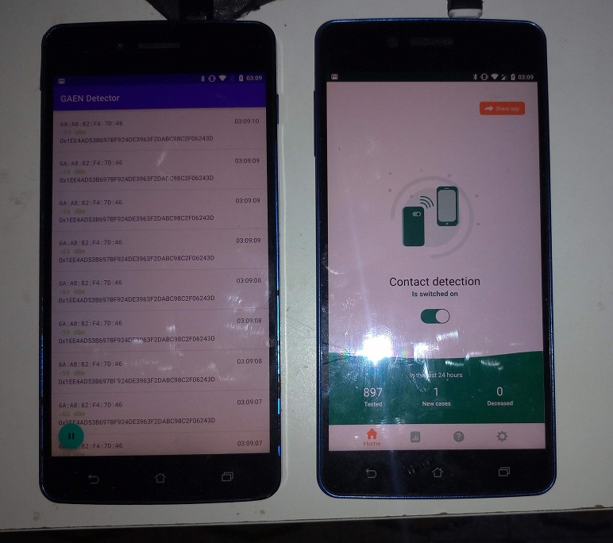
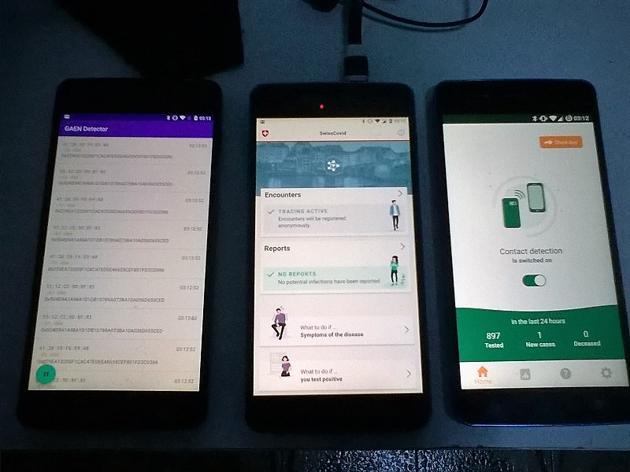

# GAEN Detector

This app displays the beacons received from devices running apps with GAEN support (Google+Apple Exposure Notifications API). Based on STOP COVID DETECTOR by **Rémy Grünblatt** - https://remy.grunblatt.org/ . 

The UUID currently matched are:

- **0000fd6f-0000-1000-8000-00805f9b34fb** (i.e. the 16 bit UUID **0xFD6F** , listed on the [Bluetooth Consortium Website](https://www.bluetooth.com/specifications/assigned-numbers/16-bit-uuids-for-members/) = UUID 64879 - Apple Inc. 27/03/2020.

## Usage

**You can compile it or use the app-release.apk build you find in /app/release folder**.

Analysis | Link
---------|-----
APKLAB | https://apklab.io/apk.html?hash=0ee4ed6c52116bd5219dc371a728f364c4e50121200646da8f5381d501c12520
Virustotal | https://www.virustotal.com/gui/file/0ee4ed6c52116bd5219dc371a728f364c4e50121200646da8f5381d501c12520/details

This app can be used to check whether the GAEN app is really working as intended (sending beacons), for instance when your phone is in sleeping mode or in standby. 

Of course, you'd need another phone to check, since your phone can't detect the beacons it sends.

You can also use it to check (without any contact) if someone is using the GAEN application or not.

It can also be used to check if your phone changes of MAC address regularly to avoid tracking.

## Pictures

